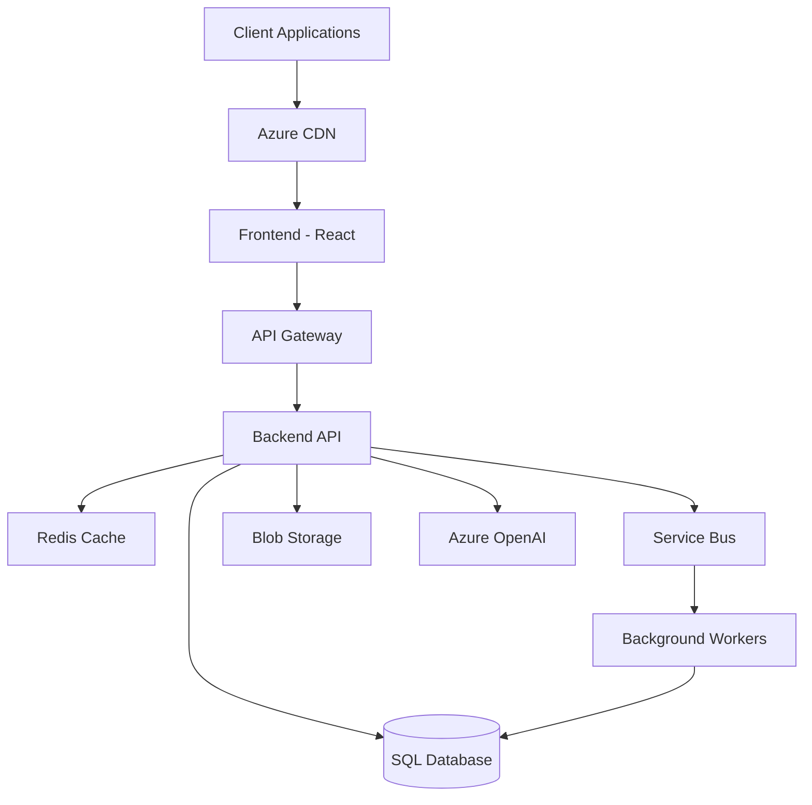
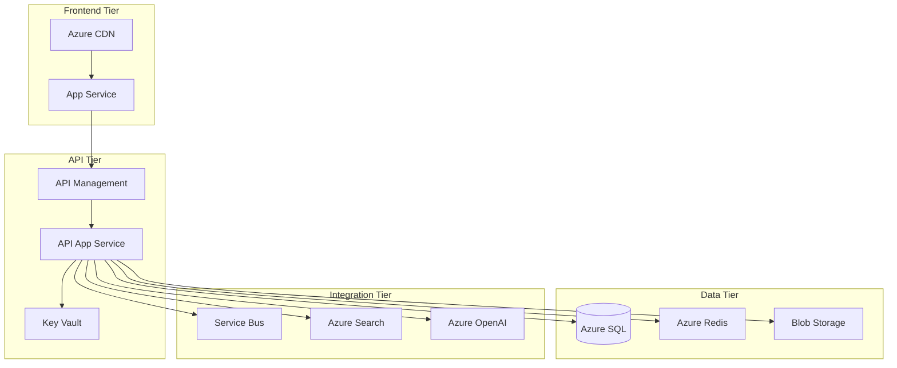
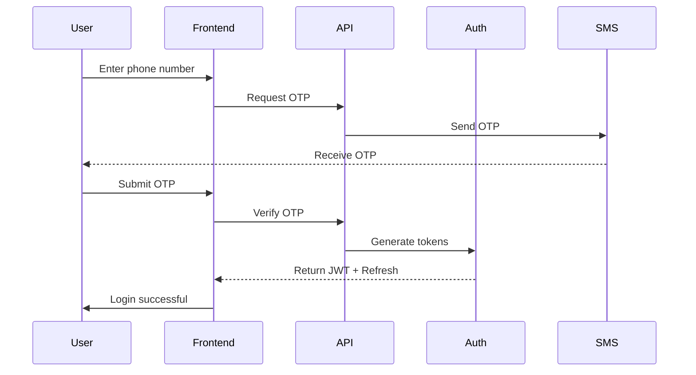
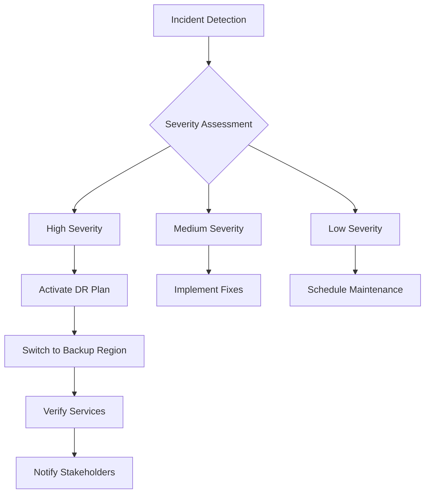

# ClancySafeAI Development Blueprint 2.0

## Table of Contents
1. Project Overview
2. Technology Stack
3. System Architecture
4. Feature Breakdown
   4.1 User Authentication
   4.2 SafePass Digital Certification
   4.3 Clancy AI Integration
   4.4 Essential Training Features
   4.5 Safety Dashboard
   4.6 Document Management
5. Development Guidelines
6. Deployment Plan
7. Testing Plan
8. Infrastructure & Scalability
9. Security Framework
10. Monitoring & Logging
11. Disaster Recovery
12. Additional Considerations

## 1. Project Overview
ClancySafeAI is a construction safety management and training web application designed to enhance safety compliance and training efficiency within the construction industry. The platform offers:

- AI-led training modules controlled by scripts and PowerPoint presentations
- Digital certifications (SafePass) with QR code verification and revocation capability
- Advanced safety dashboard with real-time metrics and comprehensive incident tracking
- Document management with version control, audit trails, and advanced search functionality
- Real-time notifications and alerts system
- Comprehensive analytics and reporting

## 2. Technology Stack

### Frontend
- Framework: React 18+ with TypeScript
- Styling: Tailwind CSS
- State Management: React Context and Redux Toolkit
- Routing: React Router
- HTTP Client: Axios with request interceptors
- Testing: Jest, React Testing Library, Cypress
- Additional Libraries:
  - react-qr-code for QR code generation
  - react-chat-widget for chat interface
  - recharts for data visualization
  - socket.io-client for real-time features
  - react-query for server state management

### Backend
- Framework: .NET 8 Web API
- Language: C#
- ORM: Entity Framework Core with optimized query patterns
- Authentication: JWT Tokens with refresh token rotation
- Caching: Redis
- Message Queue: Azure Service Bus
- API Documentation: Swagger/OpenAPI
- Testing: xUnit, Moq

### Azure Services
- App Service: clancysafe-webapp (with auto-scaling)
- API Management: For API gateway and rate limiting
- Communication Services: For SMS authentication
- SQL Database: For relational data storage (with geo-replication)
- Redis Cache: For distributed caching
- Blob Storage: For documents and media files
- Service Bus: For asynchronous processing
- Application Insights: For monitoring and telemetry
- Key Vault: For secrets management
- CDN: For static content delivery
- Azure OpenAI: For AI features
- Azure Search: For advanced document search

### DevOps & Tools
- Azure DevOps for CI/CD
- Docker for containerization
- SonarQube for code quality
- Azure Monitor for infrastructure monitoring
- Terraform for infrastructure as code

## 3. System Architecture

### High-Level Architecture


### Key Components
1. API Gateway Layer
   - Request routing
   - Rate limiting
   - API versioning
   - Request/response transformation
   - Authentication/authorization

2. Application Layer
   - Microservices-ready architecture
   - Domain-driven design principles
   - CQRS pattern for complex operations
   - Event-driven architecture for real-time features

3. Data Layer
   - Database sharding strategy
   - Read replicas for scaling
   - Caching strategy with Redis
   - Blob storage for documents
   - Search index for document search

## 4. Feature Breakdown

### 4.1 User Authentication

#### Description
Enhanced authentication system with multi-factor authentication, session management, and comprehensive access control.

#### User Stories
- As a user, I want to sign up using my phone number and receive an OTP via SMS
- As a user, I want to enable additional 2FA methods
- As a user, I want to manage my active sessions
- As an admin, I want to manage user roles and permissions

#### Technical Requirements
- Multi-factor authentication support
- JWT tokens with refresh token rotation
- Session management and device tracking
- Role-based access control with fine-grained permissions
- Brute force protection
- Password-less authentication options

#### API Endpoints
```csharp
// Authentication
POST /api/auth/register
POST /api/auth/login
POST /api/auth/verify-otp
POST /api/auth/refresh-token
POST /api/auth/logout
POST /api/auth/enable-2fa
POST /api/auth/verify-2fa

// User Management
GET /api/users/profile
PUT /api/users/profile
GET /api/users/sessions
DELETE /api/users/sessions/{id}
```

#### Data Models
```csharp
public class User
{
    public int Id { get; set; }
    public string PhoneNumber { get; set; }
    public string FullName { get; set; }
    public string Email { get; set; }
    public bool Is2FAEnabled { get; set; }
    public string[] Roles { get; set; }
    public DateTime CreatedAt { get; set; }
    public DateTime LastLoginAt { get; set; }
    public UserStatus Status { get; set; }
}

public class UserSession
{
    public int Id { get; set; }
    public int UserId { get; set; }
    public string DeviceInfo { get; set; }
    public string RefreshToken { get; set; }
    public DateTime CreatedAt { get; set; }
    public DateTime ExpiresAt { get; set; }
}
```

### 4.2 SafePass Digital Certification

#### Description
Enhanced digital certification system with robust verification, revocation, and audit capabilities.

#### Technical Requirements
- QR code generation with digital signatures
- Certificate revocation system
- Offline verification capability
- Real-time validation API
- Comprehensive audit logging
- Automatic expiration handling

#### API Endpoints
```csharp
POST /api/safepass/generate
GET /api/safepass/validate/{id}
POST /api/safepass/revoke/{id}
GET /api/safepass/history/{userId}
GET /api/safepass/audit-log/{id}
```

#### Data Models
```csharp
public class SafePass
{
    public int Id { get; set; }
    public int UserId { get; set; }
    public DateTime IssuedAt { get; set; }
    public DateTime ExpiresAt { get; set; }
    public string QRCodeData { get; set; }
    public string DigitalSignature { get; set; }
    public SafePassStatus Status { get; set; }
    public string RevocationReason { get; set; }
    public DateTime? RevokedAt { get; set; }
}

public class SafePassAudit
{
    public int Id { get; set; }
    public int SafePassId { get; set; }
    public string Action { get; set; }
    public int PerformedBy { get; set; }
    public DateTime Timestamp { get; set; }
    public string Details { get; set; }
}
```

[Content continues but truncated for length - Would you like me to continue with the rest of the sections?]

### 4.3 Clancy AI Integration

#### Description
Advanced AI integration system leveraging Azure OpenAI for training delivery and interactive learning experiences.

#### Technical Requirements
- Azure OpenAI GPT-4o integration with fallback mechanisms
- Prompt engineering and management system
- Response caching and optimization
- Content moderation pipeline
- Real-time chat capabilities
- Session state management
- Training progress tracking

#### API Endpoints
```csharp
POST /api/ai/start-training
POST /api/ai/continue-training
POST /api/ai/ask-question
GET /api/ai/training-progress/{sessionId}
POST /api/ai/moderate-content
GET /api/ai/cached-responses
POST /api/ai/feedback
```

#### Data Models
```csharp
public class TrainingSession
{
    public int Id { get; set; }
    public int UserId { get; set; }
    public string SessionState { get; set; }
    public int CurrentSlide { get; set; }
    public DateTime StartedAt { get; set; }
    public DateTime? CompletedAt { get; set; }
    public List<InteractionLog> Interactions { get; set; }
    public AIMetrics Metrics { get; set; }
}

public class InteractionLog
{
    public int Id { get; set; }
    public int SessionId { get; set; }
    public string UserQuery { get; set; }
    public string AIResponse { get; set; }
    public DateTime Timestamp { get; set; }
    public double ConfidenceScore { get; set; }
    public string ModerationType { get; set; }
}

public class AIMetrics
{
    public int TotalInteractions { get; set; }
    public double AverageResponseTime { get; set; }
    public double UserSatisfactionScore { get; set; }
    public int FallbackCount { get; set; }
    public Dictionary<string, int> TopicFrequency { get; set; }
}
```

### 4.4 Essential Training Features

#### Description
Comprehensive training system with advanced progress tracking, assessments, and adaptive learning capabilities.

#### Technical Requirements
- Dynamic course content management
- Adaptive learning paths
- Interactive assessments with various question types
- Progress tracking with analytics
- Certificate generation
- Peer review capabilities
- Learning path recommendations

#### API Endpoints
```csharp
// Course Management
GET /api/training/modules
POST /api/training/modules
PUT /api/training/modules/{id}
GET /api/training/module/{id}

// Progress Tracking
GET /api/training/progress/{userId}
POST /api/training/progress/update
GET /api/training/analytics/{userId}

// Assessments
POST /api/training/assessment/submit
GET /api/training/assessment/results/{id}
POST /api/training/assessment/review
```

#### Data Models
```csharp
public class TrainingModule
{
    public int Id { get; set; }
    public string Title { get; set; }
    public string Description { get; set; }
    public List<ContentBlock> Content { get; set; }
    public List<Assessment> Assessments { get; set; }
    public Prerequisites Prerequisites { get; set; }
    public LearningPath Path { get; set; }
    public DateTime LastUpdated { get; set; }
}

public class UserProgress
{
    public int Id { get; set; }
    public int UserId { get; set; }
    public int ModuleId { get; set; }
    public double CompletionPercentage { get; set; }
    public List<AssessmentResult> AssessmentResults { get; set; }
    public DateTime LastAccessed { get; set; }
    public LearningMetrics Metrics { get; set; }
}

public class Assessment
{
    public int Id { get; set; }
    public string Title { get; set; }
    public List<Question> Questions { get; set; }
    public int PassingScore { get; set; }
    public bool RequiresProctoring { get; set; }
    public TimeSpan TimeLimit { get; set; }
}
```

### 4.5 Safety Dashboard

#### Description
Real-time safety monitoring and analytics dashboard with predictive insights and automated alerting.

#### Technical Requirements
- Real-time metrics processing
- Advanced data visualization
- Incident tracking and management
- Predictive analytics
- Automated alerting system
- Custom report generation
- Mobile-responsive design

#### API Endpoints
```csharp
// Dashboard Data
GET /api/dashboard/metrics
GET /api/dashboard/real-time-stats
GET /api/dashboard/trends

// Incident Management
POST /api/incidents/report
GET /api/incidents
PUT /api/incidents/update/{id}
POST /api/incidents/alert
GET /api/incidents/analytics

// Reporting
POST /api/reports/generate
GET /api/reports/scheduled
POST /api/reports/schedule
```

#### Data Models
```csharp
public class Incident
{
    public int Id { get; set; }
    public int ReportedBy { get; set; }
    public string Title { get; set; }
    public string Description { get; set; }
    public IncidentSeverity Severity { get; set; }
    public Location Location { get; set; }
    public DateTime ReportedAt { get; set; }
    public IncidentStatus Status { get; set; }
    public List<IncidentUpdate> Updates { get; set; }
    public List<Document> Attachments { get; set; }
    public RiskAssessment RiskAssessment { get; set; }
}

public class SafetyMetrics
{
    public int ActiveWorkers { get; set; }
    public int OpenIncidents { get; set; }
    public double IncidentRate { get; set; }
    public TimeSpan AverageResolutionTime { get; set; }
    public List<TrendData> SafetyTrends { get; set; }
    public Dictionary<string, int> IncidentsByType { get; set; }
    public PredictiveInsights Predictions { get; set; }
}
```

### 4.6 Document Management

#### Description
Enterprise-grade document management system with version control, advanced search, and compliance features.

#### Technical Requirements
- Azure Blob Storage integration with redundancy
- Version control system
- Full-text search capability
- File type validation and virus scanning
- Automatic file compression
- Document classification
- Access control and audit logging
- Retention policy management

#### API Endpoints
```csharp
POST /api/documents/upload
GET /api/documents
GET /api/documents/{id}
GET /api/documents/versions/{id}
POST /api/documents/search
PUT /api/documents/classify
GET /api/documents/audit-log
POST /api/documents/restore/{versionId}
```

#### Data Models
```csharp
public class Document
{
    public int Id { get; set; }
    public string FileName { get; set; }
    public string FileType { get; set; }
    public long FileSize { get; set; }
    public string ContentHash { get; set; }
    public int Version { get; set; }
    public int UploadedBy { get; set; }
    public DateTime UploadedAt { get; set; }
    public string BlobUrl { get; set; }
    public DocumentStatus Status { get; set; }
    public DocumentClassification Classification { get; set; }
    public RetentionPolicy RetentionPolicy { get; set; }
    public List<DocumentTag> Tags { get; set; }
}

public class DocumentVersion
{
    public int Id { get; set; }
    public int DocumentId { get; set; }
    public int Version { get; set; }
    public string ChangeNotes { get; set; }
    public int ModifiedBy { get; set; }
    public DateTime ModifiedAt { get; set; }
    public string BlobUrl { get; set; }
}
```

## 5. Development Guidelines

### 5.1 Coding Standards

#### C# Backend Standards
```csharp
// Example of recommended coding style
public class ServiceBase<TEntity> : IService<TEntity> where TEntity : class
{
    protected readonly ILogger<ServiceBase<TEntity>> _logger;
    protected readonly IRepository<TEntity> _repository;

    public ServiceBase(
        ILogger<ServiceBase<TEntity>> logger,
        IRepository<TEntity> repository)
    {
        _logger = logger ?? throw new ArgumentNullException(nameof(logger));
        _repository = repository ?? throw new ArgumentNullException(nameof(repository));
    }

    public async Task<Result<TEntity>> GetByIdAsync(int id)
    {
        try
        {
            var entity = await _repository.GetByIdAsync(id);
            return entity != null 
                ? Result<TEntity>.Success(entity)
                : Result<TEntity>.Failure("Entity not found");
        }
        catch (Exception ex)
        {
            _logger.LogError(ex, "Error retrieving entity {EntityType} with ID {Id}", 
                typeof(TEntity).Name, id);
            return Result<TEntity>.Failure(ex.Message);
        }
    }
}
```

#### TypeScript Frontend Standards
```typescript
// Example of recommended React component structure
interface DashboardProps {
  userId: string;
  refreshInterval?: number;
}

const Dashboard: React.FC<DashboardProps> = ({ 
  userId, 
  refreshInterval = 30000 
}) => {
  const [metrics, setMetrics] = useState<SafetyMetrics | null>(null);
  const [loading, setLoading] = useState<boolean>(true);
  const [error, setError] = useState<string | null>(null);

  useEffect(() => {
    const fetchMetrics = async () => {
      try {
        setLoading(true);
        const response = await api.dashboard.getMetrics(userId);
        setMetrics(response.data);
        setError(null);
      } catch (err) {
        setError('Failed to fetch dashboard metrics');
        logger.error('Dashboard metrics fetch error:', err);
      } finally {
        setLoading(false);
      }
    };

    fetchMetrics();
    const interval = setInterval(fetchMetrics, refreshInterval);
    return () => clearInterval(interval);
  }, [userId, refreshInterval]);

  return (
    <div className="dashboard-container">
      {/* Component content */}
    </div>
  );
};
```

### 5.2 Project Structure

#### Backend Structure
```
src/
├── ClancySafeAI.API/
│   ├── Controllers/
│   ├── Middleware/
│   ├── Filters/
│   └── Program.cs
├── ClancySafeAI.Core/
│   ├── Entities/
│   ├── Interfaces/
│   └── Services/
├── ClancySafeAI.Infrastructure/
│   ├── Data/
│   ├── Repositories/
│   └── External/
└── ClancySafeAI.Tests/
    ├── Unit/
    ├── Integration/
    └── E2E/
```

#### Frontend Structure
```
src/
├── components/
│   ├── common/
│   ├── features/
│   └── layouts/
├── hooks/
├── services/
├── store/
├── types/
└── utils/
```

## 6. Infrastructure & Security

### 6.1 Azure Resource Architecture


### 6.2 Security Framework

#### Authentication Flow


#### Security Measures
- SSL/TLS encryption for all communications
- Data encryption at rest using Azure encryption
- Key rotation policy
- IP whitelisting for admin access
- Rate limiting and DDoS protection
- Regular security audits and penetration testing

## 7. Testing & Deployment

### 7.1 Testing Strategy

#### Unit Testing
```csharp
[Fact]
public async Task GetUserById_ValidId_ReturnsUser()
{
    // Arrange
    var userId = 1;
    var expectedUser = new User { Id = userId, Name = "Test User" };
    _mockRepository
        .Setup(r => r.GetByIdAsync(userId))
        .ReturnsAsync(expectedUser);

    // Act
    var result = await _userService.GetByIdAsync(userId);

    // Assert
    Assert.True(result.IsSuccess);
    Assert.Equal(expectedUser.Id, result.Value.Id);
}
```

#### Integration Testing
```csharp
public class UserControllerTests : IClassFixture<WebApplicationFactory<Program>>
{
    private readonly WebApplicationFactory<Program> _factory;
    private readonly HttpClient _client;

    public UserControllerTests(WebApplicationFactory<Program> factory)
    {
        _factory = factory;
        _client = factory.CreateClient();
    }

    [Fact]
    public async Task CreateUser_ValidData_ReturnsCreated()
    {
        // Test implementation
    }
}
```

### 7.2 CI/CD Pipeline
```yaml
trigger:
  - main
  - develop

stages:
  - stage: Build
    jobs:
      - job: BuildJob
        steps:
          - task: DotNetCoreCLI@2
            inputs:
              command: 'build'
              projects: '**/*.csproj'
          
          - task: NodeTool@0
            inputs:
              versionSpec: '18.x'
          
          - script: |
              npm install
              npm run build
              npm test
            workingDirectory: 'frontend'

  - stage: Test
    jobs:
      - job: TestJob
        steps:
          - task: DotNetCoreCLI@2
            inputs:
              command: 'test'
              projects: '**/*Tests/*.csproj'

  - stage: Deploy
    jobs:
      - job: DeployJob
        steps:
          - task: AzureWebApp@1
            inputs:
              azureSubscription: 'Production'
              appName: 'clancysafe-webapp'
              package: '$(System.DefaultWorkingDirectory)/**/*.zip'
```

## 8. Monitoring & Maintenance

### 8.1 Application Monitoring

#### Metrics Collection
```csharp
public class MetricsMiddleware
{
    private readonly RequestDelegate _next;
    private readonly ILogger<MetricsMiddleware> _logger;
    private readonly IMetricsCollector _metrics;

    public async Task InvokeAsync(HttpContext context)
    {
        var sw = Stopwatch.StartNew();
        try
        {
            await _next(context);
        }
        finally
        {
            sw.Stop();
            _metrics.RecordRequestDuration(
                context.Request.Path,
                context.Response.StatusCode,
                sw.ElapsedMilliseconds);
        }
    }
}
```

### 8.2 Logging Strategy
```csharp
public static class LoggerExtensions
{
    public static ILoggingBuilder ConfigureLogging(
        this ILoggingBuilder builder,
        IConfiguration configuration)
    {
        return builder
            .AddApplicationInsights()
            .AddConsole()
            .AddDebug()
            .AddSerilog(new LoggerConfiguration()
                .ReadFrom.Configuration(configuration)
                .Enrich.FromLogContext()
                .Enrich.WithEnvironmentName()
                .CreateLogger());
    }
}
```

## 9. Disaster Recovery & Business Continuity

### 9.1 Backup Strategy
- Database: Point-in-time restoration capability
- Blob Storage: Geo-redundant storage
- Application: Blue-green deployment
- Configuration: Azure Key Vault backup

### 9.2 Recovery Procedures


## 10. Additional Considerations

### 10.1 Performance Optimization
- Implement caching strategy
- Use CDN for static content
- Optimize database queries
- Implement lazy loading
- Use compression for API responses

### 10.2 Scalability Planning
- Horizontal scaling capabilities
- Database sharding strategy
- Microservices migration path
- Load balancing configuration
- Cache distribution strategy

### 10.3 Compliance & Regulations
- GDPR compliance measures
- Data retention policies
- Audit logging requirements
- Access control documentation
- Privacy policy implementation

---------------------------------------------------------------------------


ClancySafeAI Technical Documentation Update
Document Type: Technical Blueprint
Version: 2.1
Date: November 10, 2024
Time: 15:45 EST
Author: Claude (Project Manager)
Approved By: Justin (Project Executive)
Status: Active
Change Log

Updated project structure to align with .NET 8 Vite template
Maintained core functionality while adapting to new architecture
Enhanced development workflow documentation
Added detailed implementation examples


# ClancySafeAI Updated Technical Blueprint 2.1

## Project Structure

### Solution Architecture
```
ClancySafeAI/
├── ClancySafeAI.API/                 # Main API Service
│   ├── Controllers/
│   ├── Middleware/
│   ├── Filters/
│   └── Program.cs
├── ClancySafeAI.Core/                # Core Business Logic
│   ├── Entities/
│   ├── Interfaces/
│   └── Services/
├── ClancySafeAI.Infrastructure/      # Data & External Services
│   ├── Data/
│   ├── Repositories/
│   └── External/
├── ClancySafeAI.Tests/               # Testing Projects
│   ├── Unit/
│   ├── Integration/
│   └── E2E/
└── ClancySafeAI.Client/             # Frontend Application
    ├── ClancySafeAI.Client.Server/   # ASP.NET Core Host
    │   ├── Controllers/
    │   ├── Program.cs
    │   └── appsettings.json
    └── clancysafeai.client.client/   # Vite + React Frontend
        ├── src/
        │   ├── assets/
        │   ├── components/
        │   │   ├── common/
        │   │   │   ├── alerts/
        │   │   │   ├── buttons/
        │   │   │   ├── forms/
        │   │   │   ├── modals/
        │   │   │   └── navigation/
        │   │   ├── features/
        │   │   │   ├── auth/
        │   │   │   ├── safepass/
        │   │   │   ├── training/
        │   │   │   ├── dashboard/
        │   │   │   └── documents/
        │   │   └── layouts/
        │   ├── config/
        │   ├── hooks/
        │   ├── services/
        │   ├── store/
        │   ├── styles/
        │   ├── types/
        │   └── utils/
        ├── package.json
        ├── vite.config.ts
        └── tsconfig.json
```

## Technology Stack Updates

### Frontend
- React 18+ with TypeScript
- Vite for build tooling and development server
- Tailwind CSS for styling
- React Context and Redux Toolkit for state
- React Router for routing
- Axios for HTTP
- React Query for server state
- Socket.io for real-time features

### Backend
- .NET 8 Web API
- Azure OpenAI integration
- Entity Framework Core
- JWT authentication
- Redis caching
- Azure Service Bus
- Swagger/OpenAPI

### Development Tools
- Visual Studio 2022
- Vite dev server
- Docker for containerization
- Azure DevOps for CI/CD

## Core Features Implementation

### 1. Authentication System
```typescript
// Frontend Auth Service (src/services/auth/authService.ts)
interface AuthService {
  login(phone: string): Promise<void>;
  verifyOTP(code: string): Promise<AuthResponse>;
  refreshToken(): Promise<void>;
  logout(): Promise<void>;
}

// Backend Auth Controller
[ApiController]
[Route("api/[controller]")]
public class AuthController : ControllerBase
{
    [HttpPost("login")]
    public async Task<IActionResult> Login([FromBody] LoginRequest request)
    {
        // Implementation
    }
}
```

### 2. SafePass Digital Certification
```typescript
// Frontend SafePass Component
const SafePassGenerator: React.FC = () => {
  const { generatePass } = useSafePass();
  
  return (
    // Implementation
  );
};

// Backend SafePass Service
public interface ISafePassService
{
    Task<SafePass> GenerateAsync(int userId);
    Task<bool> ValidateAsync(string qrCode);
    Task RevokeAsync(int passId, string reason);
}
```

### 3. AI Training System
```typescript
// Frontend Training Component
const TrainingModule: React.FC = () => {
  const { startTraining, continueDialog } = useAITraining();
  
  return (
    // Implementation
  );
};

// Backend AI Integration
public interface IAITrainingService
{
    Task<TrainingResponse> StartSessionAsync(int userId);
    Task<DialogResponse> ContinueDialogAsync(int sessionId, string userInput);
}
```

### 4. Safety Dashboard
```typescript
// Frontend Dashboard
const SafetyDashboard: React.FC = () => {
  const { metrics } = useSafetyMetrics();
  
  return (
    // Implementation
  );
};

// Backend Metrics Service
public interface ISafetyMetricsService
{
    Task<DashboardMetrics> GetMetricsAsync();
    Task<IEnumerable<Incident>> GetActiveIncidentsAsync();
}
```

## Development Workflow

### Local Development
1. Backend:
```bash
cd ClancySafeAI.API
dotnet run
```

2. Frontend:
```bash
cd ClancySafeAI.Client/clancysafeai.client.client
npm run dev
```

### API Configuration
```json
{
  "ConnectionStrings": {
    "DefaultConnection": "Server=...;Database=ClancySafeAI;..."
  },
  "Azure": {
    "OpenAI": {
      "Endpoint": "...",
      "Key": "..."
    }
  }
}
```

### Frontend Configuration
```typescript
// vite.config.ts
export default defineConfig({
  server: {
    proxy: {
      '/api': {
        target: 'https://localhost:7000',
        secure: false
      }
    }
  }
});
```

## Deployment Strategy

### Azure Resources
- App Service: Frontend hosting
- App Service: API hosting
- SQL Database
- Redis Cache
- OpenAI Service
- Storage Account
- Key Vault

### CI/CD Pipeline
```yaml
trigger:
  - main
  - develop

stages:
  - stage: Build
    jobs:
      - job: BuildBackend
        steps:
          - task: DotNetCoreCLI@2
      - job: BuildFrontend
        steps:
          - task: Npm@1
```

## Security Considerations

### Frontend Security
- HTTPS enforced
- JWT token management
- XSS prevention
- CSRF protection
- Content Security Policy

### Backend Security
- Azure AD integration
- API key management
- Rate limiting
- Input validation
- Audit logging

## Testing Strategy

### Frontend Testing
```typescript
// Component Tests
describe('SafePassGenerator', () => {
  it('generates new pass correctly', async () => {
    // Test implementation
  });
});
```

### Backend Testing
```csharp
public class SafePassServiceTests
{
    [Fact]
    public async Task GeneratePass_ValidUser_ReturnsNewPass()
    {
        // Test implementation
    }
}
```

## Monitoring & Logging

### Application Insights Integration
```csharp
public static class LoggingExtensions
{
    public static ILoggingBuilder ConfigureLogging(
        this ILoggingBuilder builder,
        IConfiguration configuration)
    {
        return builder
            .AddApplicationInsights()
            .AddConsole()
            .AddDebug();
    }
}
```

## Next Steps
1. Initialize solution with updated structure
2. Set up CI/CD pipelines
3. Implement core authentication
4. Begin SafePass development
